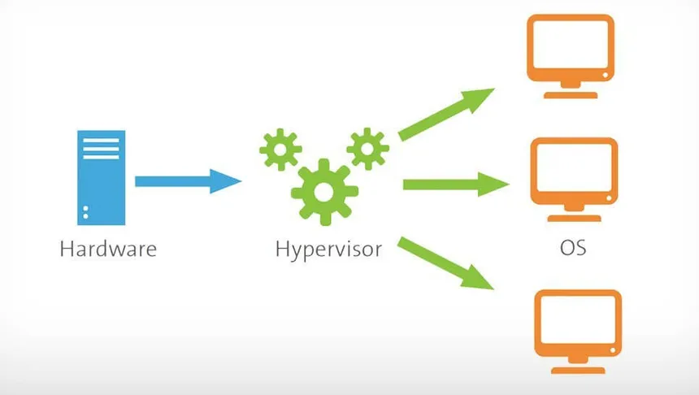
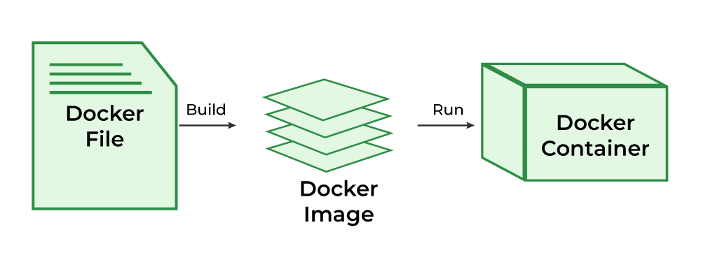
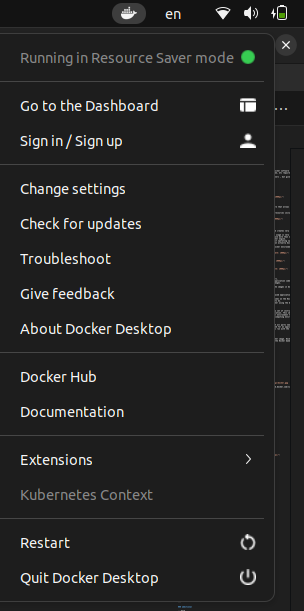
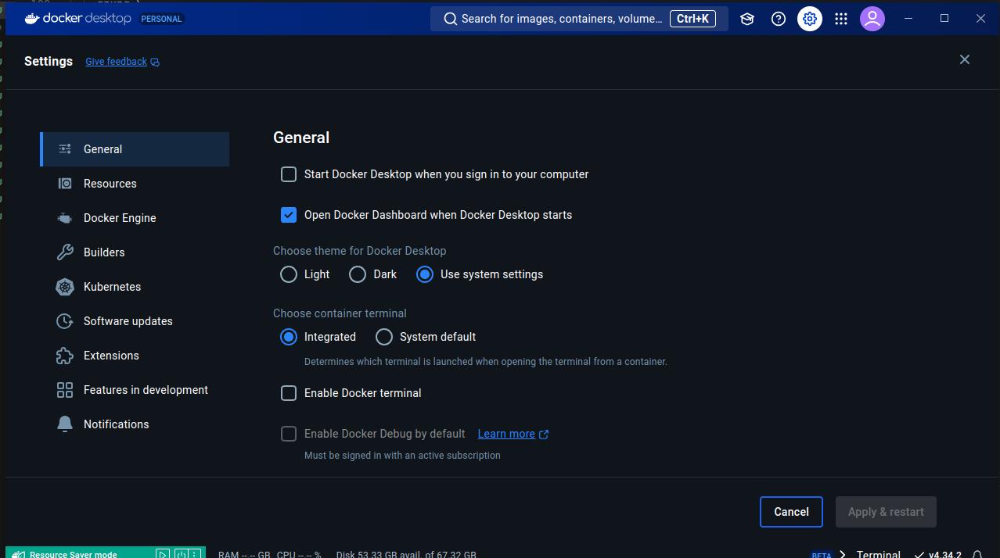
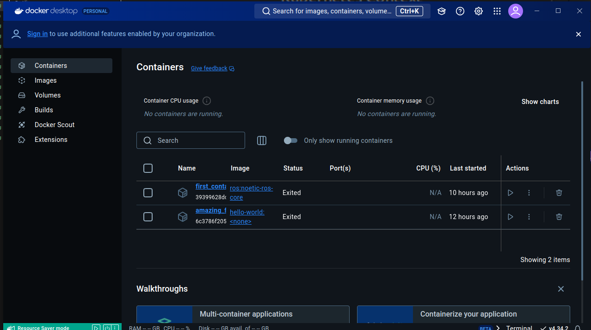
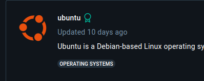

# docker session

## intro

* what is docker ?
* what is virtualization ?
* what is hypervisor ?
* containerization vs virtualization ?

### what is docker ?

Docker is an open platform that enables users to develop, ship, and run applications with ease. Docker software is packaged as containers- a docker standardized unit. These containers have all the elements, such as system tools, libraries, runtime, etc required by the software.

an application running in container is isolated from the rest of the system and from pther containers , but gives the illusion of running in its own os instance

multible docker containers can be run on the single OS

docker is a container mangment servic

### what is virtualization ?

<div align="center">
  
</div>

### what is hypervisior ?

A hypervisor, also known as a virtual machine monitor or VMM. The hypervisor is a piece of software that allows us to build and run virtual machines which are abbreviated as VMs.

A hypervisor allows a single host computer to support multiple virtual machines (VMs) by sharing resources including memory and processing.

<div align="center">
  
</div>

### docker vs VM  ?

* The virtual environment has a hypervisor layer, whereas Docker has a Docker engine layer.
* There are additional layers of libraries within the virtual machine, each of which compounds and creates very significant differences between a Docker environment and a virtual machine environment.
* With a virtual machine, the memory usage is very high, whereas, in a Docker environment, memory usage is very low.
* In terms of performance, when you start building out a virtual machine, particularly when you have more than one virtual machine on a server, the performance becomes poorer. With Docker, the performance is always high because of the single Docker engine.
* In terms of portability, virtual machines just are not ideal. They’re still dependent on the host operating system, and a lot of problems can happen when you use virtual machines for portability. In contrast, Docker was designed for portability. You can actually build solutions in a Docker container, and the solution is guaranteed to work as you have built it no matter where it’s hosted.
* The boot-up time for a virtual machine is fairly slow in comparison to the boot-up time for a Docker environment, in which boot-up is almost instantaneous.

<div align="center">
  
</div>

<div align="center">
  
</div>

<div align="center">
  
</div>

## docker components

* Docker Engine:It is a core part of docker, that handles the creation and management of containers.
* Docker Image: It is a read-only template that is used for creating containers, containing the application code and dependencies.
* Docker Hub: It is a cloud based repository that is used for finding and sharing the container images.
* Dockerfile: It is a script that containing instructions to build a docker image.
* Docker Registry  : It is a storage distribution system for docker images, where you can store the images in both public and private modes.

<div align="center">
  
</div>

### Docker Engine

The software that hosts the containers is named Docker Engine. Docker Engine is a client-server based application. The docker engine has 3 main components:

1. ServerIt is responsible for creating and managing Docker images, containers, networks, and volumes on the Docker. It is referred to as a daemon process.
2. REST API:It specifies how the applications can interact with the Server and instructs it what to do.
3. ClientThe Client is a docker command-line interface (CLI), that allows us to interact with Docker using the docker commands.

### docker images :

It is a file, comprised of multiple layers, used to execute code in a Docker container. They are a set of instructions used to create docker containers. Docker Image is an executable package of software that includes everything needed to run an application. This image informs how a container should instantiate, determining which software components will run and how. Docker Container is a virtual environment that bundles application code with all the dependencies required to run the application. The application runs quickly and reliably from one computing environment to another.

### container :

Docker container is a runtime instance of an image. Allows developers to package applications with all parts needed such as libraries and other dependencies. Docker Containers are runtime instances of Docker images. Containers contain the whole kit required for an application, so the application can be run in an isolated way. For eg.- Suppose there is an image of Ubuntu OS with NGINX SERVER when this image is run with the docker run command, then a container will be created and NGINX SERVER will be running on Ubuntu OS.

### dockerfile :

The Dockerfile uses DSL (Domain Specific Language) and contains instructions for generating a Docker image. Dockerfile will define the processes to quickly produce an image. While creating your application, you should create a Dockerfile in order since the Docker daemon runs all of the instructions from top to bottom.

<div align="center">
  
</div>

## install docker

[docker install doc ](https://docs.docker.com/desktop/install/linux/ubuntu/)

```bash
$ sudo apt-get update

$ sudo apt-get install \
    ca-certificates \
    curl \
    gnupg \
    lsb-release
$ sudo mkdir -p /etc/apt/keyrings
$ curl -fsSL https://download.docker.com/linux/ubuntu/gpg | sudo gpg --dearmor -o /etc/apt/keyrings/docker.gpg
$ echo \
  "deb [arch=$(dpkg --print-architecture) signed-by=/etc/apt/keyrings/docker.gpg] https://download.docker.com/linux/ubuntu \
  $(lsb_release -cs) stable" | sudo tee /etc/apt/sources.list.d/docker.list > /dev/null

$ sudo apt-get update
$ sudo apt-get install docker-ce docker-ce-cli containerd.io docker-compose-plugin
$ sudo groupadd docker
$ sudo usermod -aG docker $USER
```

also

```bash
 $ sudo apt-get install docker.io
```

to verfiy it is running

```bash
$ sudo docker run hello-world
```

### docker settings with docker desktop

#### docker desktop when it is running

<div align="center">
  
</div>

> after click on change settings you can change the settings whaterver you want

<div align="center">
  
</div>

> if you click on dashboard you could find your containers , images and so on

<div align="center">
  
</div>

## docker commands

### docker hub

<div align="center">
  
</div>

### verfied repository

<div align="center">
  
</div>

#### **to get an image from docker hub**

```shell
$ docker pull <docker image name >:<tag>

```

#### help menu

```bash
$ docker --help
```

#### know images in you device

```bash
$ docker images
```

#### containers

```bash
$ docker container -- help
```

#### create new container

```bash
$ docker run -it --name 
```

#### to know the active containers

```bash
$ docker ps
```

#### to know all the containers

```bash
$ docker ps -a
```

#### to get out from the container

```bash
$ ctlr +d or exit
```

#### to know the stats

```bash
$ docker container stats
```

#### to remove containers

```bash
$ docker rm <name_of_the_container>
```

#### to remove image

```bash
$ docker rmi <name_of_the_image>
```

#### to start a pre created container and start working

```bash
$ docker start -i <container_name>
```

### additional command we should know 

```bash
xhost local:root
```

this will allow you in the container to run gui and graphics with the x server as a root `
